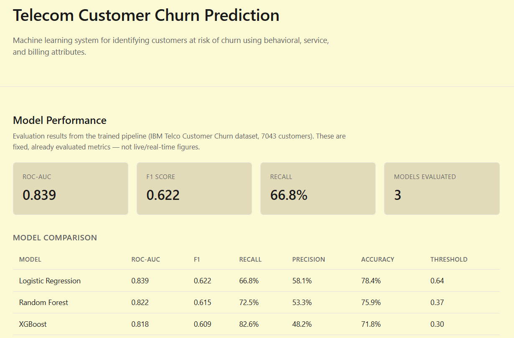
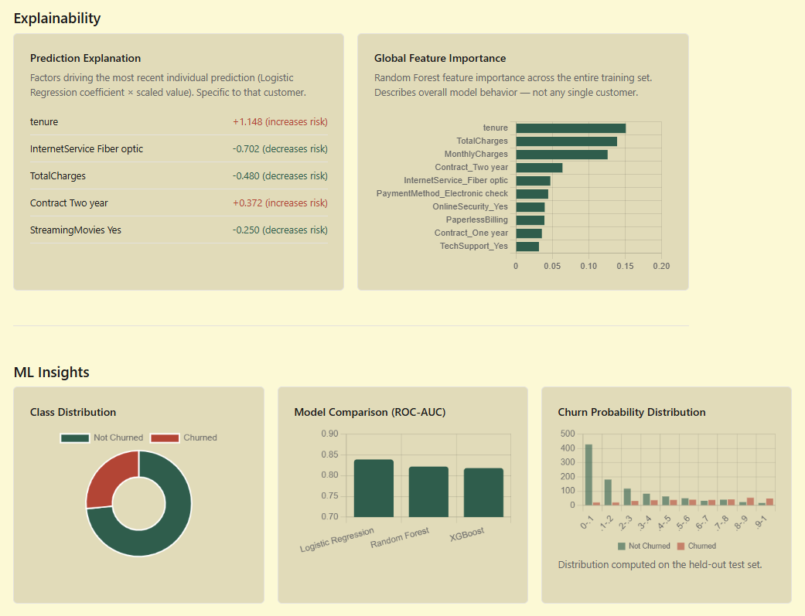
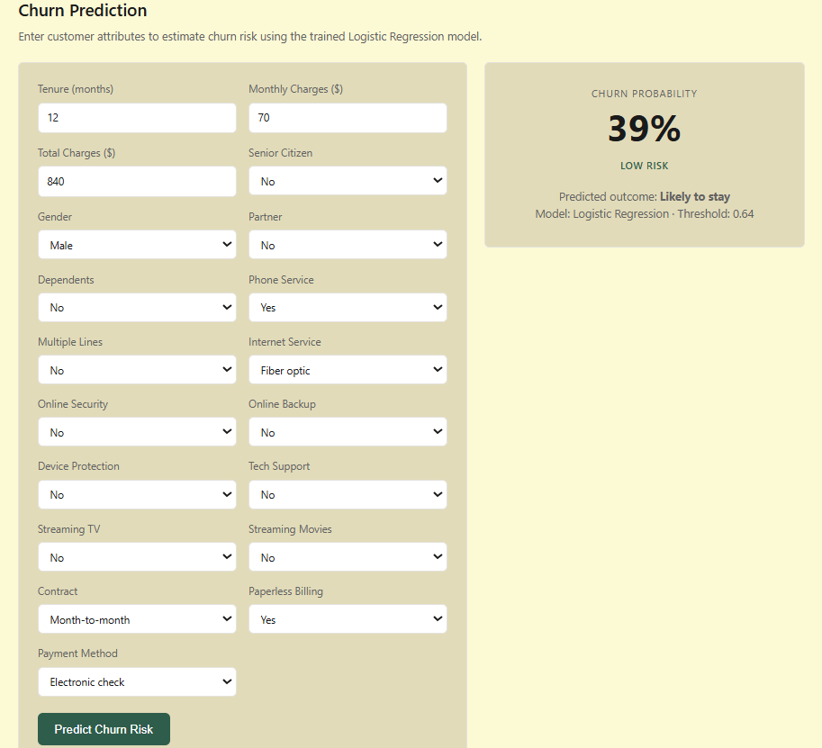

# Telecom Customer Churn Prediction

End-to-end machine learning system that predicts telecom customer churn risk — from data preprocessing and model training through a deployed REST API and web interface.






## Overview

Built on the IBM Telco Customer Churn dataset (7,043 customers, 26.5% churn rate). Three models were trained and compared, class imbalance was handled with SMOTE and class weighting, and decision thresholds were tuned per model to maximize F1 rather than relying on a naive 0.5 cutoff.

| Model | Accuracy | Precision | Recall | F1 | ROC-AUC | Threshold |
|---|---|---|---|---|---|---|
| Logistic Regression | 78.4% | 58.1% | 66.8% | 0.622 | 0.839 | 0.64 |
| Random Forest | 75.9% | 53.4% | 72.5% | 0.615 | 0.822 | 0.37 |
| XGBoost | 71.8% | 48.2% | 82.6% | 0.609 | 0.818 | 0.30 |

Logistic Regression has the best F1/ROC-AUC; XGBoost trades precision for the highest recall (catches more at-risk customers, at the cost of more false positives) — a trade-off a business would tune based on the relative cost of a missed churner vs. a wasted retention offer.

## Features

- **Churn prediction** — single-customer form with live probability, risk tier, and predicted outcome
- **Explainability** — global Random Forest feature importance alongside a per-customer prediction explanation (Logistic Regression coefficient × scaled value), kept clearly distinct
- **Batch prediction** — CSV upload → scored CSV download
- **ML insights** — class distribution, model comparison, and churn probability distribution charts
- **REST API** — trained artifacts loaded once at startup, no retraining on request

## Tech Stack

**ML:** scikit-learn, XGBoost, imbalanced-learn (SMOTE), pandas, NumPy
**Backend:** Flask, SQLite
**Frontend:** HTML/CSS/JavaScript, Chart.js
**Infra:** Docker

## Architecture

```
backend/
  app.py                  # Flask entrypoint
  preprocessing/           # shared preprocessing (train + serve, no duplication)
  services/                 # prediction, explainability, database
  routes/                    # API endpoints
frontend/                  # single-page UI, no build step
model_training/           # reproducible training script
models/                    # trained artifacts (scaler, 3 models, metadata)
```

Preprocessing logic lives in exactly one module, imported by both the training script and the live prediction service — guaranteeing no train/serve skew.

## API

```
POST /api/predict          # single customer -> probability, risk level, explanation
POST /api/predict/batch    # CSV upload -> scored CSV download
GET  /api/metrics          # fixed evaluation metrics
GET  /api/insights         # chart data (class distribution, feature importance, etc.)
```

Example response:
```json
{
  "churn_probability": 0.78,
  "prediction": 1,
  "risk_level": "High",
  "predicted_outcome": "Likely to churn",
  "explanation": [
    {"feature": "Contract Month-to-month", "contribution": 0.42, "direction": "increases risk"}
  ]
}
```

## Local Setup

```bash
python -m venv venv && source venv/bin/activate
pip install -r requirements.txt

# download the IBM Telco Customer Churn CSV to data/telco_churn.csv
python model_training/train_model.py

cd backend && python app.py   # http://localhost:5000
```

## Docker

```bash
docker build -t churn-app .
docker run -p 5000:5000 churn-app
```

## Notes

All reported metrics are the actual evaluation results from the training pipeline — nothing is estimated or fabricated. This is my personal portfolio project; no production deployment or business-impact figures are claimed.
